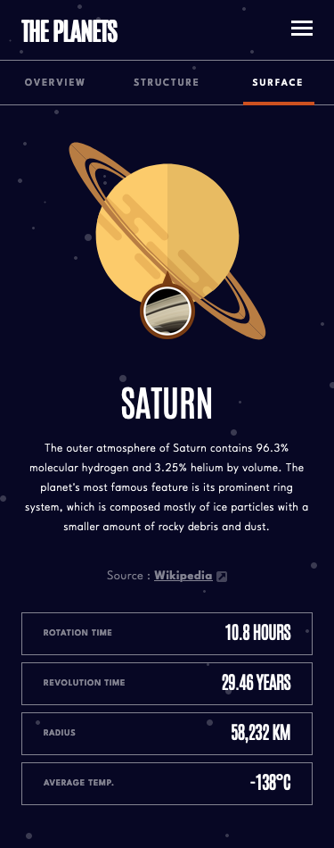
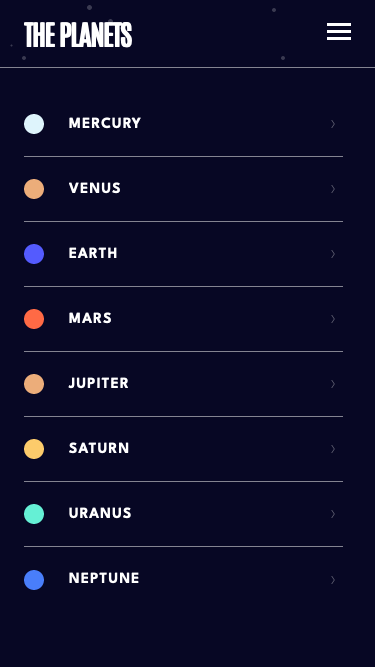

# Frontend Mentor - Planets fact site solution

This is a solution to the [Planets fact site challenge on Frontend Mentor](https://www.frontendmentor.io/challenges/planets-fact-site-gazqN8w_f). Frontend Mentor challenges help you improve your coding skills by building realistic projects.

## Table of contents

- [Overview](#overview)
  - [The challenge](#the-challenge)
  - [Screenshot](#screenshot)
  - [Links](#links)
- [My process](#my-process)
  - [Built with](#built-with)
- [Author](#author)

**Note: Delete this note and update the table of contents based on what sections you keep.**

## Overview

### The challenge

Users should be able to:

- View the optimal layout for the app depending on their device's screen size
- See hover states for all interactive elements on the page
- View each planet page and toggle between "Overview", "Internal Structure", and "Surface Geology"

### Screenshot

)

### Links

- Solution URL: [Frontend Mentor](https://www.frontendmentor.io/solutions/responsive-design-using-react-scss-animated-transitions-qsLhKMQdRO)
- Live Site URL: [GitHub.io](https://anglicus.github.io/fem_planet-facts-site/)

## My process

### Built with

- Semantic HTML5 markup
- Flexbox
- CSS Grid
- Mobile-first workflow
- [React](https://reactjs.org/) - JS library
- SCSS

## Author

- GitHub - [@anglicus](https://github.com/anglicus)
- Frontend Mentor - [@anglicus](https://www.frontendmentor.io/profile/anglicus)
- FreeCodeCamp [@anglicus] (https://www.freecodecamp.org/anglicus)
- Codepen - [@anglicus](https://codepen.io/anglicus)
